# RS6026: Open Science Practices in Remote Sensing Final Report

**111022003 Chong-Ruei, Lin 2023/06/08**

## Topic: 
Detecting Landslides with Improved Accuracy using Multi-Temporal Satellite Optical Techniques on the Google Earth Engine Platform

## Abstract

Due to the rapidly changing climate, the frequency of landslides has been increasing. To mitigate the risks associated with landslides, a combination of satellite systems and traditional in-situ measurements can be highly beneficial. This study focused on the Yusui River Watershed area and utilized Sentinel-2 data to investigate a specific landslide event. To analyze the landslide, the study employed the calculation of the Normalized Difference Vegetation Index (NDVI) from pre- and post-event satellite images. The resulting difference NDVI images (dNDVI) were generated. A comparison between the pre- and post-event Sentinel-2 images revealed a higher number of landslides in the post-event image. Furthermore, the negative values in the difference NDVI images indicated a loss of vegetation in the study area. In order to facilitate the widespread use of this technique, the study leveraged the Google Earth Engine platform, which enables automated implementation and global applicability. Google Earth Engine is a cloud-based platform that provides access to various geospatial datasets, including optical image collections, SAR data, land cover classifications, and precipitation data. The study also involved creating a repository on GitHub, where the researchers stored their code and related metadata. The repository, along with the accompanying code and metadata, was made publicly accessible on the Google Earth Engine platform and GitHub. By openly sharing my research, it could foster continuous improvement of the methodology and encourage collaboration within the field of Open Science and Landslide Detection.

## Keyword:

landslide, Sentinel-2, Google Earth Engine, dNDVI, open science

## Introduction

The frequency of landslides has seen a rapid rise due to the impact of climate change. To effectively mitigate these risks, the combination of satellite systems and in-situ measurements can provide valuable support. Taiwan, in particular, experiences frequent typhoons during the summer season, resulting in heavy rainfall that easily triggers landslides in hilly areas. As a consequence, transportation systems are disrupted, and local properties suffer damage.

This study focuses on investigating a specific landslide that occurred in southern Taiwan following a typhoon event on August 7th, 2021. The investigation will utilize Sentinel-2 data, which offers detailed satellite imagery. By analyzing the Sentinel-2 data, the study aims to develop effectively way to monitor landslide-prone areas. The following are the main objectives of the study:

- 	By calculating the NDVI index in pre- and post-event images, the aim is to identify an efficient way to track the landslide after the event.

- 	By using the Google Earth Engine platform, making the technique is completely automated and easily applicable on a global scale.

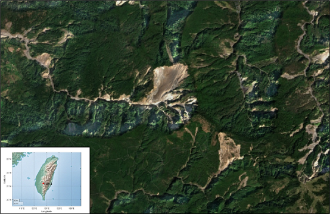

Fig 1. The Sentinel-2 image of study area from google earth engine (Time:2023.03.01). 
The brown area represents bare soil.  

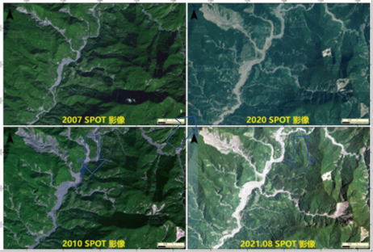

Fig 2. The SPOT image of study area from 2007 to August 2021. It is evident that there are areas of exposed land visible. Moreover, there are signs of expansion since 2010. (Source:農委會水土保持局)

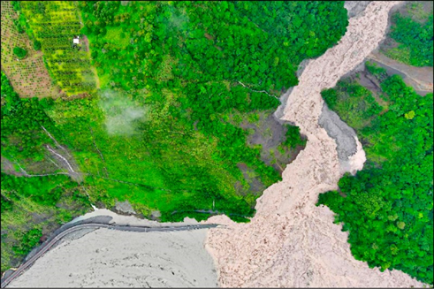

Fig 3. In 2021, the Typhoon Lubit brought heavy rainfall to the region, resulting in extensive landslides that caused road blockages (Source:農委會水土保持局)


## Methodology

The study utilized freely accessible Sentinel-2 data to investigate the Yusui River Watershed area (玉穗溪流域地區) using Google Earth Engine. Further, the study collected 100 images before the event and two images after the event to generate pre- and post-event composites. Further, the NDVI value was calculated from the images. By subtracting the pre-event NDVI from the post-event NDVI, the differenced normalized difference vegetation index (dNDVI) can be obtained. 

## Dataset

The study collected a total of 100 images before the landslide event and two images after the event. These images were utilized to generate pre- and post-event composites. Specifically, the study focused on extracting Sentinel-2 images of the research area with a cloud-free condition and a resolution of 10 meters. By gathering a substantial number of pre-event images and carefully selecting cloud-free images, the study aimed to obtain accurate and representative data for the pre-event composite. Similarly, the post-event images were chosen to capture the after-month of the landslide event and provide relevant information for the post-event composite. The use of Sentinel-2 imagery with a resolution of 10 meters allows for detailed analysis of the research area, enabling the identification of specific features and changes related to the landslide occurrence. This high-resolution data enhances the study's ability to examine the impact and extent of the landslide accurately.

Tab 1. The Detection Image Composites Used for Manual Landslide Detection.
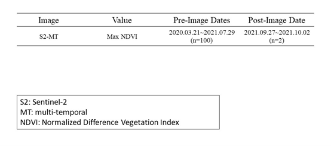


## Platform 
## [Google Earth Engine](https://code.earthengine.google.com/)
**Needed to log in with Google account**

Google Earth Engine is a cloud-based platform offering diverse geospatial datasets, such as optical images, SAR data, land cover classifications, and precipitation data. It excels in handling large-scale datasets, enabling global-scale investigations of phenomena like climate change, deforestation, and natural disasters. Researchers leverage its tools and functions for advanced analysis, image processing, and geospatial manipulation. The platform's programming interface empowers users to develop custom algorithms. Google Earth Engine fosters collaboration, reproducibility, and scalability, facilitating efficient exploration, analysis, and visualization of extensive geospatial data for informed decision-making.


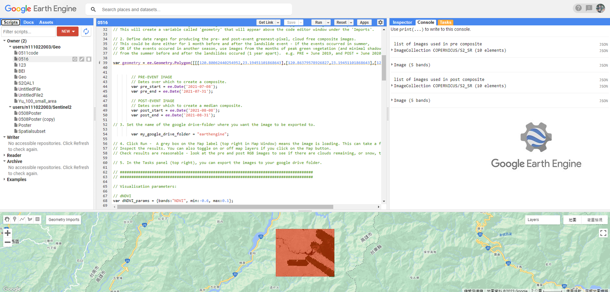

Fig 4. Google Earth interface. Google Earth Engine provides a user-friendly interface that allows users to import various datasets. In the middle section, users can edit Java-based code to perform analysis and processing tasks. On the left side, users can create repositories to organize their projects. On the right side, users can view and download lists of datasets to their Google Drive. Additionally, users can add different layers to the map interface, enabling them to preview and visualize the results of their analyses.

## Workflow 

The study is divided into two parts. The first part involves generating dNDVI (difference NDVI) images from pre- and post-event data using the Google Earth Engine platform. Sentinel-2 images are utilized to subset the study area and select the desired time period. Cloud-free images are chosen, and NDVI is calculated by subtracting Band 4 from Band 8.

The second part focuses on the public release of the study. The study provides the code and metadata through platforms like GitHub and Zenodo. Additionally, I offer a link to access the study on the Google Earth Engine platform, allowing others to explore and replicate the analysis conducted in the study.

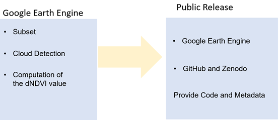

Fig 5. Workflow of this study. 

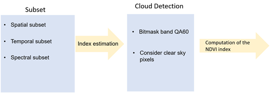

Fig 6. Workflow of Google Earth Engine section. 

The analysis in this study relies on the dNDVI (difference NDVI) approach. This involves subtracting the pre-event image from the post-event image to detect changes. By comparing the values of Band 8 (near-infrared) and Band 4 (red) in the images, the differences in vegetation can be emphasized. Negative values in the dNDVI indicate a loss of vegetation, indicating areas where vegetation has been affected by the landslide event.

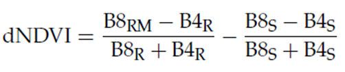 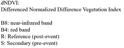
Formula 1. dNDVI

**[GEE code](https://code.earthengine.google.com/74c9601441dee79efc6c142811275bb4?noload=true)**


```
// Author: Erin Lindsay. erin.lindsay@ntnu.no
// Created: 18.02.2022

//Instructions for use:

// This script is to be run in Google Earth Engine Code Editor. 
// This requires a free user account which can be created here: https://earthengine.google.com/new_signup/ 

// Fill in the required user inputs, then click Run.

// The result can be downloaded as a Geotiff by clicking on the Tasks tab, in the panel to the right. 
// The images include 5 bands: 'B2' = blue, 'B3' = green, 'B4' = red, 'B8' = near-infrared, 'NDVI' = Normalised Difference Vegetation Index
// These can be viewed as RGB composites, false colour composites, or as a single band NDVI. 

// How it works:

// Cloud filtering is done using the COPERNICUS/S2_CLOUD_PROBABILITY dataset, 
// the ee.Algorithms.Sentinel2.CDI() method for computing a cloud displacement index 
// and directionalDistanceTransform() for computing cloud shadows.
// Source: https://developers.google.com/earth-engine/tutorials/community/sentinel-2-s2cloudless 

// Snow filtering is done using the SCL band from the Level-2A product COPERNICUS/S2

// Pre- and post-event composite images are made from the filtered Sentinel-2 Level 2A images, using the greenest-pixel method. 
// The difference image is created by subtracting the pre-event image from the post-event image. 

// ##########################   User Inputs: #########################################
// ###################################################################################

// 1. Define area of interest: 
// In the bottom map window, using the drawing buttons to the left, draw a polygon or rectangle around your area of interest. 
// This will create a variable called 'geometry' that will appear above the code editor window under the 'Imports'.

// 2. Define date ranges for producing the pre- and post-event greenest-pixel, cloud free composite images. 
// This could be done either for 1 month before and after the landslide event - if the events occurred in summer, 
// OR if the events occured in another season, use images from the months of peak green vegetation (and minimal shadows) 
// from the summer before and after the landslides occured (1 year apart).  e.g. PRE = June 2019, and POST = June 2020. 

var geometry = ee.Geometry.Polygon([[[120.80062440254952,23.19451101868643],[120.86379578926827,23.19451101868643],[120.86379578926827,23.147166689849],[120.80062440254952,23.147166689849]]])


        // PRE-EVENT IMAGE
        // Dates over which to create a composite.
        var pre_start = ee.Date('2021-07-08');
        var pre_end = ee.Date('2021-07-31');
        
        // POST-EVENT IMAGE
        // Dates over which to create a median composite.
        var post_start = ee.Date('2021-08-08');
        var post_end = ee.Date('2021-08-31');
        
// 3. Set the name of the google drive-folder where you want the image to be exported to.
        
        var my_google_drive_folder = "earthengine";
	
// 4. Click Run -  A grey box on the Map label (top right in Map Window) means the image is loading. This can take a few minutes. 
// Inspect the results. You can also toggle on or off map layers if you click on the Map button. 
// Check results are reasonable - look at the pre and post RGB images to see if there are clouds remaining, or snow, that will affect the NDVI results.

// 5. In the Tasks panel (top right), you can export the images to your google drive folder. 

// #####################################################################################
// #####################################################################################

// Visualisation parameters:

// dNDVI
var dNDVI_params = {bands:"NDVI", min:-0.6, max:0.1};

// RGB true colour
var viz_rgb = {bands: ['B4', 'B3', 'B2'], min: 0, max: 3000};

// #########################   Functions #########################
// Add NDVI  
  function addS2NDVI(image) {
    var ndvi = image.normalizedDifference(['B8', 'B4']).rename('NDVI');
    return image.addBands(ndvi);
  }

// snow mask 
function maskSnow(image) {
//  var lake_mask = ee.Image.constant(1).clip(lakes).mask().not();
  var SCL = image.select('SCL');
  var snow = SCL.eq(11).toFloat();
  snow = snow.not().focal_min({radius: 300, units: 'meters'});
  return image
  .updateMask(snow)
//  .updateMask(lake_mask)
  .clip(geometry);
}

// Cloud and shadow filtering:

// Join two collections on their 'system:index' property.
// The propertyName parameter is the name of the property
// that references the joined image.
function indexJoin(collectionA, collectionB, propertyName) {
  var joined = ee.ImageCollection(ee.Join.saveFirst(propertyName).apply({
    primary: collectionA,
    secondary: collectionB,
    condition: ee.Filter.equals({
      leftField: 'system:index',
      rightField: 'system:index'})
  }));
  // Merge the bands of the joined image.
  return joined.map(function(image) {
    return image.addBands(ee.Image(image.get(propertyName)));
  });
}

// Aggressively mask clouds and shadows.
function maskImage(image) {
  // Compute the cloud displacement index from the L1C bands.
  var cdi = ee.Algorithms.Sentinel2.CDI(image);
  var s2c = image.select('probability');
  var cirrus = image.select('B10').multiply(0.0001);

  // Assume low-to-mid atmospheric clouds to be pixels where probability
  // is greater than 65%, and CDI is less than -0.5. For higher atmosphere
  // cirrus clouds, assume the cirrus band is greater than 0.01.
  // The final cloud mask is one or both of these conditions.
  var isCloud = s2c.gt(65).and(cdi.lt(-0.5)).or(cirrus.gt(0.01));

  // Reproject is required to perform spatial operations at 20m scale.
  // 20m scale is for speed, and assumes clouds don't require 10m precision.
  isCloud = isCloud.focal_min(3).focal_max(16);
  isCloud = isCloud.reproject({crs: cdi.projection(), scale: 20});

  // Project shadows from clouds we found in the last step. This assumes we're working in
  // a UTM projection.
  var shadowAzimuth = ee.Number(90)
      .subtract(ee.Number(image.get('MEAN_SOLAR_AZIMUTH_ANGLE')));
      
  // With the following reproject, the shadows are projected 5km.
  isCloud = isCloud.directionalDistanceTransform(shadowAzimuth, 50);
  isCloud = isCloud.reproject({crs: cdi.projection(), scale: 100});

  isCloud = isCloud.select('distance').mask();
  return image.select('B2', 'B3', 'B4', 'B8', 'SCL', 'NDVI').float()
  .updateMask(isCloud.not())
;
}

// #########################   Import Image Collections  #########################

// Sentinel-2 Level 1C data.  Bands B7, B8, B8A and B10 from this
// dataset are needed as input to CDI and the cloud mask function.
var s2 = ee.ImageCollection('COPERNICUS/S2');
// Cloud probability dataset.  The probability band is used in
// the cloud mask function.

// Sentinel-2 surface reflectance data for the composite.
var s2Sr = ee.ImageCollection('COPERNICUS/S2_SR');

var region = geometry
Map.centerObject(geometry);

// #########################   Make Pre Image  #########################

// S2 L1C for Cloud Displacement Index (CDI) bands.
var pre_s2 = s2.filterBounds(geometry).filterDate(pre_start, pre_end)
    .select(['B7', 'B8', 'B8A', 'B10']);
// S2Cloudless for the cloud probability band.
var pre_s2c = s2c.filterDate(pre_start, pre_end).filterBounds(geometry);
// S2 L2A for surface reflectance bands.
var pre_s2Sr = s2Sr.filterDate(pre_start, pre_end).filterBounds(geometry)
    .map(addS2NDVI)
    .select(['B2', 'B3', 'B4', 'B5', 'B8', 'SCL', 'NDVI']);

// Join the cloud probability dataset to surface reflectance.
var pre_withCloudProbability = indexJoin(pre_s2Sr, pre_s2c, 'cloud_probability');
// Join the L1C data to get the bands needed for CDI.
var pre_withS2L1C = indexJoin(pre_withCloudProbability, pre_s2, 'l1c');
// print(pre_withS2L1C);

// Map the cloud masking function over the joined collection.
var pre_masked = ee.ImageCollection(pre_withS2L1C.map(maskImage).map(maskSnow));
  print('list of images used in pre composite', pre_masked);

var pre_qualM = pre_masked.qualityMosaic('NDVI').select(['B2', 'B3', 'B4', 'B8', 'NDVI']);
print(pre_qualM);

// Display the results.
Map.addLayer(pre_qualM, viz_rgb, 'pre greenest RGB composite');

// #########################   Make Post Image  #########################

// S2 L1C for Cloud Displacement Index (CDI) bands.
var post_s2 = s2.filterBounds(geometry).filterDate(post_start, post_end)
    .select(['B7', 'B8', 'B8A', 'B10']);
// S2Cloudless for the cloud probability band.
var post_s2c = s2c.filterDate(post_start, post_end).filterBounds(geometry);
// S2 L2A for surface reflectance bands.
var post_s2Sr = s2Sr.filterDate(post_start, post_end).filterBounds(geometry)
    .map(addS2NDVI)
    .select(['B2', 'B3', 'B4', 'B5', 'B8', 'SCL', 'NDVI']);

// Join the cloud probability dataset to surface reflectance.
var post_withCloudProbability = indexJoin(post_s2Sr, post_s2c, 'cloud_probability');
// Join the L1C data to get the bands needed for CDI.
var post_withS2L1C = indexJoin(post_withCloudProbability, post_s2, 'l1c');
// print(post_withS2L1C);

// Map the cloud masking function over the joined collection.
var post_masked = ee.ImageCollection(post_withS2L1C.map(maskImage).map(maskSnow))
  print('list of images used in post composite', post_masked);

var post_qualM = post_masked.qualityMosaic('NDVI').select(['B2', 'B3', 'B4', 'B8', 'NDVI']);
print(post_qualM);

// Display the results.
Map.addLayer(post_qualM, viz_rgb, 'post greenest RGB composite');

// #########################   Make Difference Image  #########################

var diff = post_qualM.subtract(pre_qualM);
Map.addLayer(diff, dNDVI_params, 'dNDVI_cloud_filtered');

// ##################    EXPORT IMAGES   ##########################
  
Export.image.toDrive({
		image : pre_qualM,
		description : 'cloud_snow_masked_qualM_S2_SR_pre',
		scale : 10,
		folder : my_google_drive_folder,
		region : geometry
	});

Export.image.toDrive({
		image : post_qualM,
		description : 'cloud_snow_masked_qualM_S2_SR_post',
		scale : 10,
		folder : my_google_drive_folder,
		region : geometry
	});	

Export.image.toDrive({
		image : diff,
		description : 'cloud_snow_masked_qualM_S2_SR_diff',
		scale : 10,
		folder : my_google_drive_folder,
		region : geometry
	});

```

## Result and Discussion  

Figure 7 displays the Sentinel-2 images of the study area. A comparison between pre- and post-event images reveals that there were more landslides in the post-event image. To display this more clearly, the post-event image was subtracted from the pre-event image on the NDVI band. 

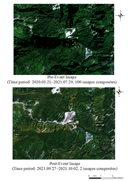

Fig 7. Sentinel-2 Images of Study Area. (R:blue-band, G: green band, B: red band.)

In the resulting difference NDVI image, the black areas which correspond to negative dNDVI values indicate a loss of vegetation in the study area. Overall, study area showed a remarkable reduction in vegetation due to the typhoon event.

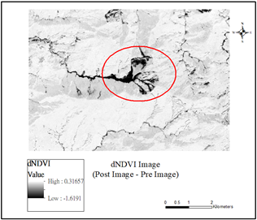

Fig 8. Difference NDVI Image. Black corresponds areas with vegetation loss (negative NDVI). 

To obtain high-accuracy information for continuous monitoring of landslide areas, an approach index can be employed. This approach involves utilizing specific algorithms or indices tailored for landslide detection and monitoring, such as the Normalized Difference Vegetation Index (NDVI) or other relevant indices.

To make the code and metadata accessible to others, the study will provide them in a repository. The repository can be hosted on platforms like GitHub, where the code and related metadata can be stored and shared with the research community. Additionally, the code and metadata will be made publicly available on the Google Earth Engine platform, allowing others to access and utilize them for their own analysis and research purposes. This facilitates collaboration, reproducibility, and the further advancement of landslide monitoring methodologies.


## Future works 

For future work, the following tasks can be considered:

1. Conduct on-site investigations to validate the data obtained from the analysis. On-site visits can provide ground truth information and help validate the accuracy of the results.

2. Adapt the ALICE index (or any other relevant index) from reference data to further enhance the landslide detection and monitoring process. This adaptation can help improve the accuracy and reliability of the analysis.

3. Continue using abs(dNDVI) values to effectively highlight the landslide area as bright pixels in the plotted image. This approach can provide a visual representation of the affected areas and aid in the identification and mapping of landslide events.

4. Regularly update the code and metadata on the Google Earth Engine platform and Zenodo. This ensures that the latest version of the code and relevant information is available to the research community, promoting reproducibility and enabling others to build upon the work.

5. Explore the possibility of retrieving imagery from other optical satellites, such as LandSAT, to complement the analysis. Incorporating data from multiple sources can provide a more comprehensive understanding of landslide dynamics and improve the accuracy of the monitoring process.

## Feedback

I became interested in Open Science because it felt more interdisciplinary compared to traditional courses. It was refreshing to introduce the concept of Open Science through discussions and hear different perspectives from my classmates. I lacked confidence in speaking, so I hesitated to participate actively, but compared to other courses, I tried my best in this one. The concepts learned in this course, whether in the field of remote sensing or other areas, have been highly valuable. I can see the potential application of these concepts in my future research. Overall, I believe I need to improve my practical skills, and I could have participated more actively in class. Thank you, teacher, for your guidance throughout the semester.


## Reference and Appendix:

[1]	Satriano, V., Ciancia, E., Filizzola, C., Genzano, N., Lacava, T., & Tramutoli, V. (2023). Landslides Detection and Mapping with an Advanced Multi-Temporal Satellite Optical Technique. Remote Sensing, 15(2), 683.
[https://doi.org/10.3390/rs15030683](https://doi.org/10.3390/rs15030683)

[2]	Google Earth Engine Code   [
https://code.earthengine.google.com/74c9601441dee79efc6c142811275bb4?noload=true](https://code.earthengine.google.com/74c9601441dee79efc6c142811275bb4?noload=true)

[3]	Zenodo DOI
[https://zenodo.org/badge/latestdoi/651081706](https://zenodo.org/badge/latestdoi/651081706)

[4]	HTML
[https://Chong-Ruei.github.io/OpenScience/Final](https://chong-ruei.github.io/OpenScience/Final)


```python

```
